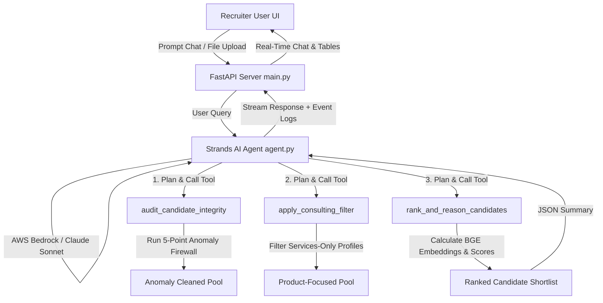

# RecruitShield AI: Autonomous Recruiter Co-Pilot (AWS Strands Agents SDK)

RecruitShield AI is a premium, production-grade candidate discovery and integrity auditing system built for the **AWS Agents for Humans Hackathon (Track 2: Professional Agents)**. 

It is designed to automate the repetitive, high-judgment process of resume screening and fraud detection by pairing a custom Python scoring pipeline with the **AWS Strands Agents SDK** and a modern **React + Vite (Frontend) + FastAPI (Backend)** web interface.

---

## 🏗️ System Architecture

Below is the workflow of how the Strands Agent acts as the brain, orchestrating python tools to filter and rank candidates:



---

## ✨ Key Features

1. **Autonomous Strands Agentic Brain**: Uses the AWS Strands SDK to dynamically plan and call custom python tools based on what the recruiter requests in the chat room. Runs live against Amazon Bedrock (Nova Pro) when AWS credentials are supplied via the Bedrock Config panel; otherwise falls back to a deterministic local execution of the same tool pipeline.
2. **5-Point Anomaly Firewall (Integrity Check)**: Automatically flags and removes logical contradictions in candidate profiles (founding-year mismatches, experience-duration inflation, 0-month expert skills, signup-after-last-active dates). Tuned against the fields present in the bundled sample dataset — see [`backend/sample_candidates.jsonl`](backend/sample_candidates.jsonl).
3. **Hybrid Semantic Matching**: Combines `BAAI/bge-base-en-v1.5` embeddings (cosine similarity, computed automatically for whatever candidate pool is loaded) with dynamic title- and skill-overlap scoring.
4. **Factual Recruiter Reasoning**: Programmatically generates explainable summaries for the shortlist directly using candidate-specific facts, ensuring zero hallucinations.
5. **Premium Glassmorphic Dashboard**: A high-end dark slate UI featuring a real-time Chat Cockpit, Agent Tool logs, Interactive shortlist tables, and drag-and-drop PDF resume/JD parsing.
6. **One-Click Export**: The "Export" action in the shortlisted-candidates view downloads a formatted `.doc` report of your starred candidates directly from the browser (no server round-trip). Separately, `GET /export` on the backend returns the currently ranked shortlist as `submission.xlsx`, for programmatic/API use.

---

## 📂 Project Structure

*   `/backend`:
    *   `main.py`: FastAPI server exposing `/chat`, `/shortlist`, `/export`, `/upload_candidates`, and `/upload_jd` endpoints.
    *   `agent.py`: Strands Agents tool definitions and agent instantiation.
    *   `ranker.py`: Core candidate filtering and embedding scoring algorithms.
    *   `sample_candidates.jsonl`: Small bundled demo dataset (15 synthetic candidates, one intentional honeypot) so the app works out of the box without a private dataset.
    *   `candidate_embeddings.npy` & `candidate_ids.json`: Neural embeddings for the currently loaded candidate pool — generated automatically at server startup and on every `/upload_candidates` call, not committed to the repo (gitignored, since they're a build artifact of whatever dataset is loaded).
*   `/frontend`:
    *   `src/App.tsx`: Main React application, handling chat, Bedrock credentials config, PDF parsing, and shortlist tables.
    *   `src/index.css`: Global vanilla CSS design system containing variables for glassmorphism and the dark-mode dashboard.
    *   `vite.config.ts`: Vite compilation setup.

---

## 🚀 Getting Started

### 1. Backend Setup (FastAPI)
From the repository root, create a virtual environment and install dependencies:
```bash
python3 -m venv venv

# Activate it
source venv/bin/activate       # macOS/Linux
# .\venv\Scripts\activate      # Windows

pip install -r requirements.txt
```
Then launch the server from the repo root (it must run from here, not from `/backend`, since it's imported as the `backend` package):
```bash
uvicorn backend.main:app --port 8000
```
On startup the backend loads a candidate database and computes its neural embeddings automatically:
- If `CANDIDATES_PATH` is set (or `backend/candidates.jsonl` exists), that dataset is used.
- Otherwise it falls back to the small bundled demo set at `backend/sample_candidates.jsonl`, so the app is fully usable immediately after a fresh clone — no private dataset required.

The API is hosted at `http://127.0.0.1:8000` (interactive docs at `/docs`). You can also drop your own dataset in later via the UI's drag-and-drop candidate upload, or `POST /upload_candidates` — either one replaces the active pool and recomputes embeddings for it.

### 2. Frontend Setup (React + Vite)
Open a new terminal window:
```bash
cd frontend
npm install
npm run dev
```
Open **[http://localhost:5173](http://localhost:5173)** in your browser to launch the Recruiter Cockpit.

### 3. AWS Bedrock Configuration
By default the agent runs in local Simulator Mode — the exact same tool pipeline (`audit_candidate_integrity` → `apply_consulting_filter` → `rank_and_reason_candidates`), executed directly rather than through a live Bedrock-hosted LLM. To run it against a real Strands + Bedrock agent instead:
1. Click the **🔐 AWS Bedrock Config** icon in the workspace header (visible on the Data Ingestion and Match screens).
2. Paste an AWS Access Key ID, Secret Access Key, and Region for a principal with Bedrock access.
3. Save Configuration.

Credentials are kept only in your browser's `localStorage` and sent directly to your own locally-running backend on each `/chat` request — they are never persisted server-side or sent anywhere else. Leave the fields blank (or click Clear) to go back to Simulator Mode.