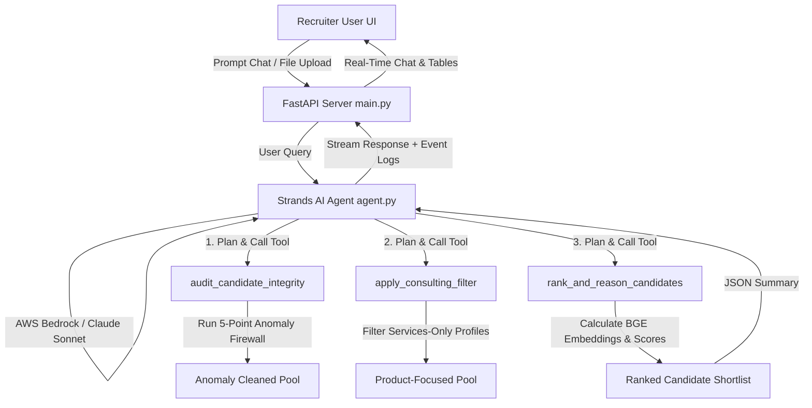

# RecruitShield AI: Autonomous Recruiter Co-Pilot (AWS Strands Agents SDK)

RecruitShield AI is a premium, production-grade candidate discovery and integrity auditing system built for the **AWS Agents for Humans Hackathon (Track 2: Professional Agents)**. 

It is designed to automate the repetitive, high-judgment process of resume screening and fraud detection by pairing a custom Python scoring pipeline with the **AWS Strands Agents SDK** and a modern **React + Vite (Frontend) + FastAPI (Backend)** web interface.

---

## 🏗️ System Architecture

Below is the workflow of how the Strands Agent acts as the brain, orchestrating python tools to filter and rank candidates:



---

## ✨ Key Features

1. **Autonomous Strands Agentic Brain**: Uses the AWS Strands SDK to dynamically plan and call custom python tools based on what the recruiter requests in the chat room.
2. **5-Point Anomaly Firewall (Integrity Check)**: Automatically flags and removes logical contradictions in candidate profiles (founding year mismatches, experience-duration inflation, 0-month expert skills).
3. **Hybrid Semantic Matching**: Combines local `BAAI/bge-small-en-v1.5` embeddings (cosine similarity) with dynamic Title and Skill depth matching matrices.
4. **Factual Recruiter Reasoning**: Programmatically generates explainable summaries for the shortlist directly using candidate-specific facts, ensuring zero hallucinations.
5. **Premium Glassmorphic Dashboard**: A high-end dark slate UI featuring a real-time Chat Cockpit, Agent Tool logs, Interactive shortlist tables, and Drag-and-drop PDF job description parsing.
6. **One-Click Export**: Downloads the fully formatted `submission.xlsx` directly from the UI.

---

## 📂 Project Structure

*   `/backend`:
    *   `main.py`: FastAPI server exposing `/chat`, `/shortlist`, `/export`, and `/upload_jd` endpoints.
    *   `agent.py`: Strands Agents tool definitions and agent instantiation.
    *   `ranker.py`: Core candidate filtering and embedding scoring algorithms.
    *   `candidate_embeddings.npy` & `candidate_ids.json`: Precomputed candidate neural embeddings.
*   `/frontend`:
    *   `src/App.tsx`: Main React application, handling chat, credentials config, PDF parsing, and shortlist tables.
    *   `src/index.css`: Global vanilla CSS design system containing variables for glassmorphism and the dark-mode dashboard.
    *   `vite.config.ts`: Vite compilation setup.

---

## 🚀 Getting Started

### 1. Backend Setup (FastAPI)
Navigate to the root directory and activate the virtual environment:
```bash
# Activate Virtual Environment
.\venv\Scripts\activate

# Launch Backend Server
uvicorn backend.main:app --port 8000
```
The database will automatically load all candidate profiles into memory on startup. The API is hosted at `http://127.0.0.1:8000`.

### 2. Frontend Setup (React + Vite)
Open a new terminal window:
```bash
cd frontend
npm install
npm run dev
```
Open **[http://localhost:5173](http://localhost:5173)** in your browser to launch the Recruiter Cockpit.

### 3. AWS Bedrock Configuration
To run the agent in real mode:
1. Click the **🔐 Bedrock Config** button in the header.
2. Paste your AWS Access Key, Secret Key, and Region.
3. Save Configuration.
*(If left empty, the agent automatically runs in local Simulator Mode, executing the exact python tools locally).*